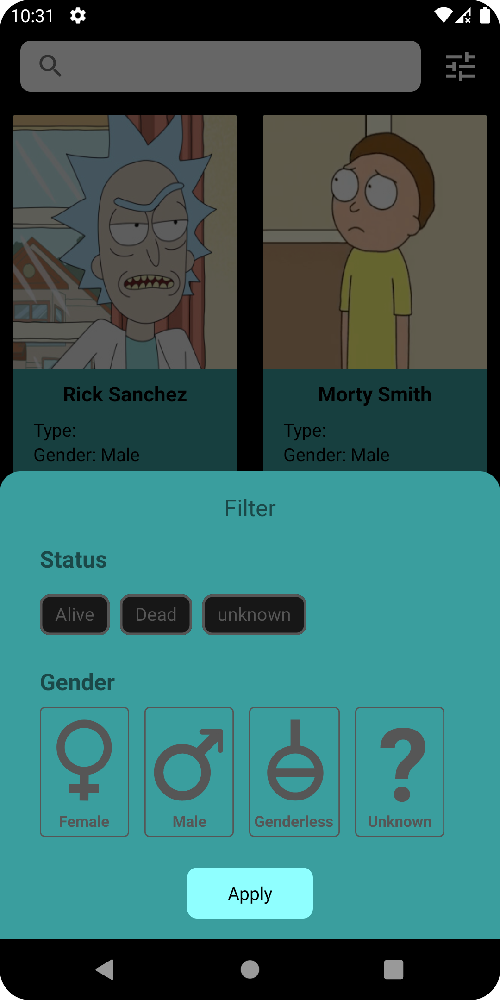

# Rick And Morty 

|  |  |  |
|-------------------------------|-------------------------------|-------------------------------|

## - Built With 🛠
- [Kotlin](https://kotlinlang.org/) - First class and official programming language for Android development.
- [Android Architecture Components](https://developer.android.com/topic/libraries/architecture) - Collection of libraries that help you design robust, testable, and maintainable apps.
  - [Flow](https://developer.android.com/kotlin/flow) - Data objects that notify views when the underlying database changes.
  - [ViewModel](https://developer.android.com/topic/libraries/architecture/viewmodel) - Stores UI-related data that isn't destroyed on UI changes. 
- [Paging3](https://developer.android.com/topic/libraries/architecture/paging/v3-overview) - The Paging library helps you load and display pages of data from a larger dataset from local storage or over network.
- [Koin](https://insert-koin.io/) - Dependency Injection Framework
- [Retrofit](https://square.github.io/retrofit/) - A type-safe HTTP client for Android and Java.
- [OkHttp](http://square.github.io/okhttp/) - HTTP client that's efficient by default: HTTP/2 support allows all requests to the same host to share a socket
- [Coil](https://coil-kt.github.io/coil/) - image loading framework for Android
- [Moshi](https://github.com/square/moshi) - used to convert Java Objects into their JSON representation and vice versa.
- [SmoothRefreshLayout](https://github.com/dkzwm/SmoothRefreshLayout) - Refreshing data with pull screen

### - Contact - Let's become friend
- [Github](https://github.com/khayalsherif)
- [Linkedin](https://www.linkedin.com/in/khayal-sharifli-822015213/)

## - License
```
MIT License

Copyright (c) 2022 Khayal Sharifli

Permission is hereby granted, free of charge, to any person obtaining a copy
of this software and associated documentation files (the "Software"), to deal
in the Software without restriction, including without limitation the rights
to use, copy, modify, merge, publish, distribute, sublicense, and/or sell
copies of the Software, and to permit persons to whom the Software is
furnished to do so, subject to the following conditions:

The above copyright notice and this permission notice shall be included in all
copies or substantial portions of the Software.

THE SOFTWARE IS PROVIDED "AS IS", WITHOUT WARRANTY OF ANY KIND, EXPRESS OR
IMPLIED, INCLUDING BUT NOT LIMITED TO THE WARRANTIES OF MERCHANTABILITY,
FITNESS FOR A PARTICULAR PURPOSE AND NONINFRINGEMENT. IN NO EVENT SHALL THE
AUTHORS OR COPYRIGHT HOLDERS BE LIABLE FOR ANY CLAIM, DAMAGES OR OTHER
LIABILITY, WHETHER IN AN ACTION OF CONTRACT, TORT OR OTHERWISE, ARISING FROM,
OUT OF OR IN CONNECTION WITH THE SOFTWARE OR THE USE OR OTHER DEALINGS IN THE
SOFTWARE.```
